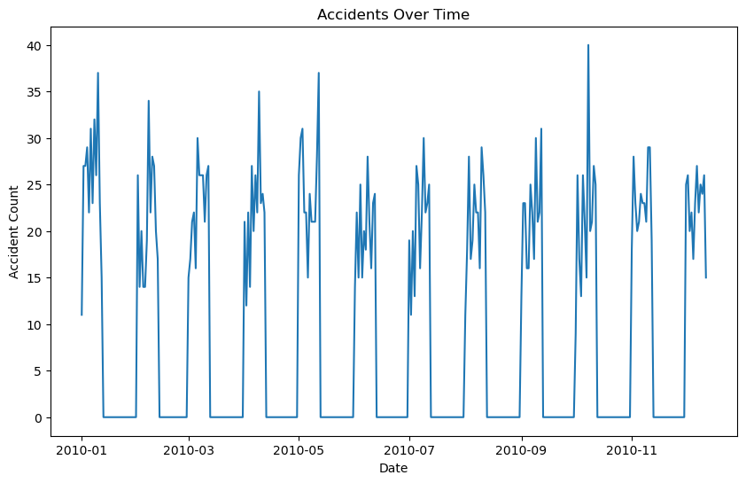
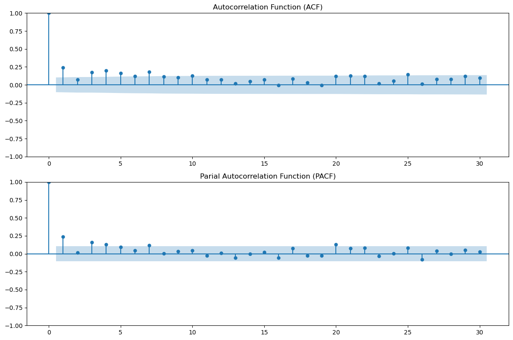
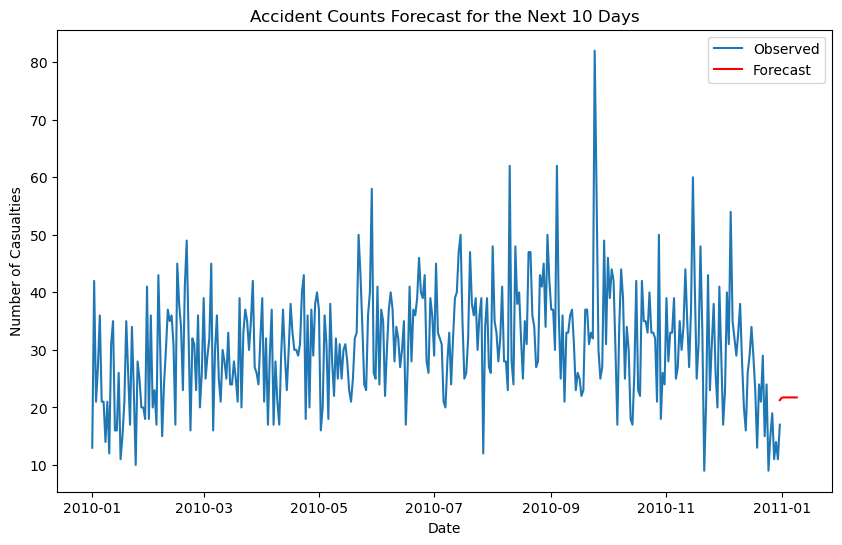
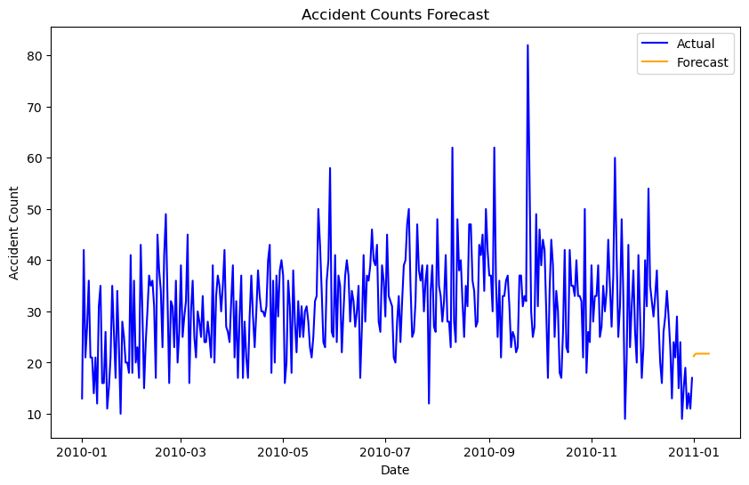
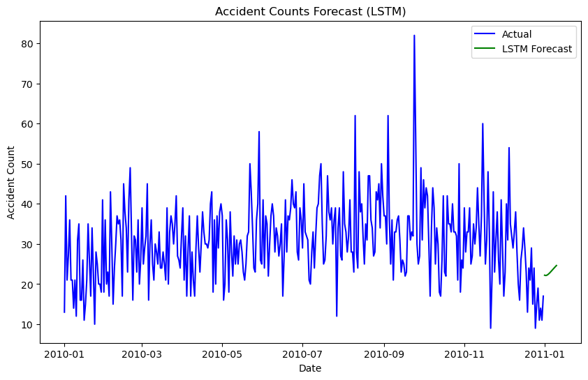
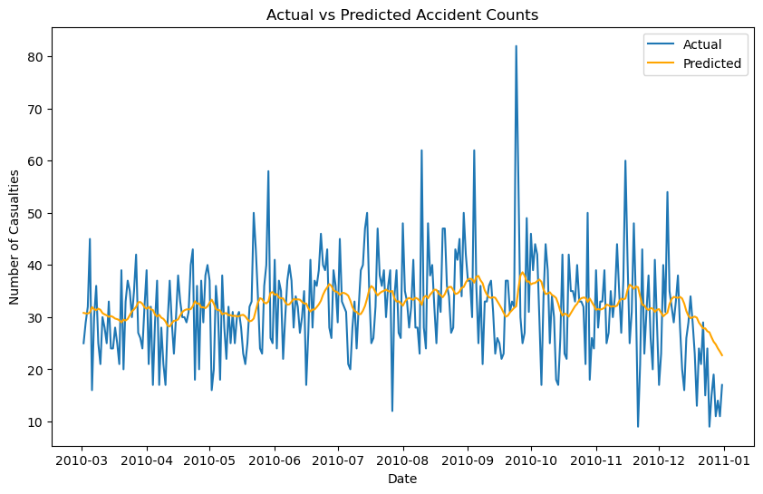

```python
!pip install numpy pandas matplotlib statsmodels scikit-learn tensorflow

```

    Defaulting to user installation because normal site-packages is not writeable
    Requirement already satisfied: numpy in c:\programdata\anaconda3\lib\site-packages (1.26.4)
    Requirement already satisfied: pandas in c:\programdata\anaconda3\lib\site-packages (2.2.2)
    Requirement already satisfied: matplotlib in c:\programdata\anaconda3\lib\site-packages (3.8.4)
    Requirement already satisfied: statsmodels in c:\programdata\anaconda3\lib\site-packages (0.14.2)
    Requirement already satisfied: scikit-learn in c:\programdata\anaconda3\lib\site-packages (1.4.2)
    Requirement already satisfied: tensorflow in c:\users\pilla\appdata\roaming\python\python312\site-packages (2.17.0)
    Requirement already satisfied: python-dateutil>=2.8.2 in c:\programdata\anaconda3\lib\site-packages (from pandas) (2.9.0.post0)
    Requirement already satisfied: pytz>=2020.1 in c:\programdata\anaconda3\lib\site-packages (from pandas) (2024.1)
    Requirement already satisfied: tzdata>=2022.7 in c:\programdata\anaconda3\lib\site-packages (from pandas) (2023.3)
    Requirement already satisfied: contourpy>=1.0.1 in c:\programdata\anaconda3\lib\site-packages (from matplotlib) (1.2.0)
    Requirement already satisfied: cycler>=0.10 in c:\programdata\anaconda3\lib\site-packages (from matplotlib) (0.11.0)
    Requirement already satisfied: fonttools>=4.22.0 in c:\programdata\anaconda3\lib\site-packages (from matplotlib) (4.51.0)
    Requirement already satisfied: kiwisolver>=1.3.1 in c:\programdata\anaconda3\lib\site-packages (from matplotlib) (1.4.4)
    Requirement already satisfied: packaging>=20.0 in c:\programdata\anaconda3\lib\site-packages (from matplotlib) (23.2)
    Requirement already satisfied: pillow>=8 in c:\programdata\anaconda3\lib\site-packages (from matplotlib) (10.3.0)
    Requirement already satisfied: pyparsing>=2.3.1 in c:\programdata\anaconda3\lib\site-packages (from matplotlib) (3.0.9)
    Requirement already satisfied: scipy!=1.9.2,>=1.8 in c:\programdata\anaconda3\lib\site-packages (from statsmodels) (1.13.1)
    Requirement already satisfied: patsy>=0.5.6 in c:\programdata\anaconda3\lib\site-packages (from statsmodels) (0.5.6)
    Requirement already satisfied: joblib>=1.2.0 in c:\programdata\anaconda3\lib\site-packages (from scikit-learn) (1.4.2)
    Requirement already satisfied: threadpoolctl>=2.0.0 in c:\programdata\anaconda3\lib\site-packages (from scikit-learn) (2.2.0)
    Requirement already satisfied: tensorflow-intel==2.17.0 in c:\users\pilla\appdata\roaming\python\python312\site-packages (from tensorflow) (2.17.0)
    Requirement already satisfied: absl-py>=1.0.0 in c:\users\pilla\appdata\roaming\python\python312\site-packages (from tensorflow-intel==2.17.0->tensorflow) (2.1.0)
    Requirement already satisfied: astunparse>=1.6.0 in c:\users\pilla\appdata\roaming\python\python312\site-packages (from tensorflow-intel==2.17.0->tensorflow) (1.6.3)
    Requirement already satisfied: flatbuffers>=24.3.25 in c:\users\pilla\appdata\roaming\python\python312\site-packages (from tensorflow-intel==2.17.0->tensorflow) (24.3.25)
    Requirement already satisfied: gast!=0.5.0,!=0.5.1,!=0.5.2,>=0.2.1 in c:\users\pilla\appdata\roaming\python\python312\site-packages (from tensorflow-intel==2.17.0->tensorflow) (0.6.0)
    Requirement already satisfied: google-pasta>=0.1.1 in c:\users\pilla\appdata\roaming\python\python312\site-packages (from tensorflow-intel==2.17.0->tensorflow) (0.2.0)
    Requirement already satisfied: h5py>=3.10.0 in c:\programdata\anaconda3\lib\site-packages (from tensorflow-intel==2.17.0->tensorflow) (3.11.0)
    Requirement already satisfied: libclang>=13.0.0 in c:\users\pilla\appdata\roaming\python\python312\site-packages (from tensorflow-intel==2.17.0->tensorflow) (18.1.1)
    Requirement already satisfied: ml-dtypes<0.5.0,>=0.3.1 in c:\users\pilla\appdata\roaming\python\python312\site-packages (from tensorflow-intel==2.17.0->tensorflow) (0.4.1)
    Requirement already satisfied: opt-einsum>=2.3.2 in c:\users\pilla\appdata\roaming\python\python312\site-packages (from tensorflow-intel==2.17.0->tensorflow) (3.4.0)
    Requirement already satisfied: protobuf!=4.21.0,!=4.21.1,!=4.21.2,!=4.21.3,!=4.21.4,!=4.21.5,<5.0.0dev,>=3.20.3 in c:\programdata\anaconda3\lib\site-packages (from tensorflow-intel==2.17.0->tensorflow) (3.20.3)
    Requirement already satisfied: requests<3,>=2.21.0 in c:\programdata\anaconda3\lib\site-packages (from tensorflow-intel==2.17.0->tensorflow) (2.32.2)
    Requirement already satisfied: setuptools in c:\programdata\anaconda3\lib\site-packages (from tensorflow-intel==2.17.0->tensorflow) (69.5.1)
    Requirement already satisfied: six>=1.12.0 in c:\programdata\anaconda3\lib\site-packages (from tensorflow-intel==2.17.0->tensorflow) (1.16.0)
    Requirement already satisfied: termcolor>=1.1.0 in c:\users\pilla\appdata\roaming\python\python312\site-packages (from tensorflow-intel==2.17.0->tensorflow) (2.5.0)
    Requirement already satisfied: typing-extensions>=3.6.6 in c:\programdata\anaconda3\lib\site-packages (from tensorflow-intel==2.17.0->tensorflow) (4.11.0)
    Requirement already satisfied: wrapt>=1.11.0 in c:\programdata\anaconda3\lib\site-packages (from tensorflow-intel==2.17.0->tensorflow) (1.14.1)
    Requirement already satisfied: grpcio<2.0,>=1.24.3 in c:\users\pilla\appdata\roaming\python\python312\site-packages (from tensorflow-intel==2.17.0->tensorflow) (1.67.0)
    Requirement already satisfied: tensorboard<2.18,>=2.17 in c:\users\pilla\appdata\roaming\python\python312\site-packages (from tensorflow-intel==2.17.0->tensorflow) (2.17.1)
    Requirement already satisfied: keras>=3.2.0 in c:\users\pilla\appdata\roaming\python\python312\site-packages (from tensorflow-intel==2.17.0->tensorflow) (3.6.0)
    Requirement already satisfied: wheel<1.0,>=0.23.0 in c:\programdata\anaconda3\lib\site-packages (from astunparse>=1.6.0->tensorflow-intel==2.17.0->tensorflow) (0.43.0)
    Requirement already satisfied: rich in c:\programdata\anaconda3\lib\site-packages (from keras>=3.2.0->tensorflow-intel==2.17.0->tensorflow) (13.3.5)
    Requirement already satisfied: namex in c:\users\pilla\appdata\roaming\python\python312\site-packages (from keras>=3.2.0->tensorflow-intel==2.17.0->tensorflow) (0.0.8)
    Requirement already satisfied: optree in c:\users\pilla\appdata\roaming\python\python312\site-packages (from keras>=3.2.0->tensorflow-intel==2.17.0->tensorflow) (0.13.0)
    Requirement already satisfied: charset-normalizer<4,>=2 in c:\programdata\anaconda3\lib\site-packages (from requests<3,>=2.21.0->tensorflow-intel==2.17.0->tensorflow) (2.0.4)
    Requirement already satisfied: idna<4,>=2.5 in c:\programdata\anaconda3\lib\site-packages (from requests<3,>=2.21.0->tensorflow-intel==2.17.0->tensorflow) (3.7)
    Requirement already satisfied: urllib3<3,>=1.21.1 in c:\programdata\anaconda3\lib\site-packages (from requests<3,>=2.21.0->tensorflow-intel==2.17.0->tensorflow) (2.2.2)
    Requirement already satisfied: certifi>=2017.4.17 in c:\programdata\anaconda3\lib\site-packages (from requests<3,>=2.21.0->tensorflow-intel==2.17.0->tensorflow) (2024.6.2)
    Requirement already satisfied: markdown>=2.6.8 in c:\programdata\anaconda3\lib\site-packages (from tensorboard<2.18,>=2.17->tensorflow-intel==2.17.0->tensorflow) (3.4.1)
    Requirement already satisfied: tensorboard-data-server<0.8.0,>=0.7.0 in c:\users\pilla\appdata\roaming\python\python312\site-packages (from tensorboard<2.18,>=2.17->tensorflow-intel==2.17.0->tensorflow) (0.7.2)
    Requirement already satisfied: werkzeug>=1.0.1 in c:\programdata\anaconda3\lib\site-packages (from tensorboard<2.18,>=2.17->tensorflow-intel==2.17.0->tensorflow) (3.0.3)
    Requirement already satisfied: MarkupSafe>=2.1.1 in c:\programdata\anaconda3\lib\site-packages (from werkzeug>=1.0.1->tensorboard<2.18,>=2.17->tensorflow-intel==2.17.0->tensorflow) (2.1.3)
    Requirement already satisfied: markdown-it-py<3.0.0,>=2.2.0 in c:\programdata\anaconda3\lib\site-packages (from rich->keras>=3.2.0->tensorflow-intel==2.17.0->tensorflow) (2.2.0)
    Requirement already satisfied: pygments<3.0.0,>=2.13.0 in c:\programdata\anaconda3\lib\site-packages (from rich->keras>=3.2.0->tensorflow-intel==2.17.0->tensorflow) (2.15.1)
    Requirement already satisfied: mdurl~=0.1 in c:\programdata\anaconda3\lib\site-packages (from markdown-it-py<3.0.0,>=2.2.0->rich->keras>=3.2.0->tensorflow-intel==2.17.0->tensorflow) (0.1.0)
    


```python
import pandas as pd

data = pd.read_csv(r'C:/SolutionsSquadGroupProject/Datasets/ACCIDENT DATASETS.csv')
```


```python
print(data.head())
```

      Accident_Severity   Carriageway_Hazards        Date Day_of_Week   Latitude  \
    0            Slight                   NaN  09/12/2010    Thursday  14.724026   
    1            Slight                   NaN  27/12/2010      Monday  14.762353   
    2            Slight                   NaN  08/11/2010      Monday  14.745606   
    3            Slight  Other object on road  16/10/2010    Saturday  14.667128   
    4            Slight                   NaN  21/12/2010     Tuesday  14.703443   
    
             Light_Conditions  Longitude  Number_of_Casualties  \
    0                Daylight  78.610393                     1   
    1  Darkness - no lighting  78.534042                     1   
    2                Daylight  78.470877                     1   
    3                Daylight  78.557994                     1   
    4                Daylight  78.576431                     1   
    
       Number_of_Vehicles Road_Surface_Conditions           Road_Type  \
    0                   1            Frost or ice  Single carriageway   
    1                   1            Frost or ice  Single carriageway   
    2                   2             Wet or damp  Single carriageway   
    3                   2                     Dry  Single carriageway   
    4                   1                    Snow      One way street   
    
       Speed_limit   Time Urban_or_Rural_Area     Weather_Conditions  
    0         60.0  15:41               Rural                  Other  
    1         60.0  21:31               Rural                  Other  
    2         30.0  15:50               Rural     Fine no high winds  
    3         30.0  13:50               Urban     Fine no high winds  
    4         30.0  13:59               Urban  Snowing no high winds  
    


```python
import pandas as pd

data = pd.read_csv(r'C:/SolutionsSquadGroupProject/Datasets/ACCIDENT DATASETS.csv')

data['Date'] = pd.to_datetime(data['Date'], errors='coerce')

data.set_index('Date', inplace=True)

data.info()

print(data.head())
```

    <class 'pandas.core.frame.DataFrame'>
    DatetimeIndex: 7988 entries, 2010-09-12 to 2010-11-08
    Data columns (total 14 columns):
     #   Column                   Non-Null Count  Dtype  
    ---  ------                   --------------  -----  
     0   Accident_Severity        7988 non-null   object 
     1   Carriageway_Hazards      200 non-null    object 
     2   Day_of_Week              7988 non-null   object 
     3   Latitude                 7988 non-null   float64
     4   Light_Conditions         7988 non-null   object 
     5   Longitude                7988 non-null   float64
     6   Number_of_Casualties     7988 non-null   int64  
     7   Number_of_Vehicles       7988 non-null   int64  
     8   Road_Surface_Conditions  7988 non-null   object 
     9   Road_Type                7988 non-null   object 
     10  Speed_limit              7987 non-null   float64
     11  Time                     7987 non-null   object 
     12  Urban_or_Rural_Area      7987 non-null   object 
     13  Weather_Conditions       7987 non-null   object 
    dtypes: float64(3), int64(2), object(9)
    memory usage: 936.1+ KB
               Accident_Severity   Carriageway_Hazards Day_of_Week   Latitude  \
    Date                                                                        
    2010-09-12            Slight                   NaN    Thursday  14.724026   
    NaT                   Slight                   NaN      Monday  14.762353   
    2010-08-11            Slight                   NaN      Monday  14.745606   
    NaT                   Slight  Other object on road    Saturday  14.667128   
    NaT                   Slight                   NaN     Tuesday  14.703443   
    
                      Light_Conditions  Longitude  Number_of_Casualties  \
    Date                                                                  
    2010-09-12                Daylight  78.610393                     1   
    NaT         Darkness - no lighting  78.534042                     1   
    2010-08-11                Daylight  78.470877                     1   
    NaT                       Daylight  78.557994                     1   
    NaT                       Daylight  78.576431                     1   
    
                Number_of_Vehicles Road_Surface_Conditions           Road_Type  \
    Date                                                                         
    2010-09-12                   1            Frost or ice  Single carriageway   
    NaT                          1            Frost or ice  Single carriageway   
    2010-08-11                   2             Wet or damp  Single carriageway   
    NaT                          2                     Dry  Single carriageway   
    NaT                          1                    Snow      One way street   
    
                Speed_limit   Time Urban_or_Rural_Area     Weather_Conditions  
    Date                                                                       
    2010-09-12         60.0  15:41               Rural                  Other  
    NaT                60.0  21:31               Rural                  Other  
    2010-08-11         30.0  15:50               Rural     Fine no high winds  
    NaT                30.0  13:50               Urban     Fine no high winds  
    NaT                30.0  13:59               Urban  Snowing no high winds  
    


```python
import pandas as pd

import matplotlib.pyplot as plt

accident_counts = data.resample('D').size()

plt.figure(figsize=(10, 6))
plt.plot(accident_counts)
plt.title('Accidents Over Time')
plt.xlabel('Date')
plt.ylabel('Accident Count')
plt.show()
```


    

    


```python
import pandas as pd
from statsmodels.tsa.stattools import adfuller
import matplotlib.pyplot as plt

data = pd.read_csv(r'C:/SolutionsSquadGroupProject/Datasets/ACCIDENT DATASETS.csv')

data['Date'] = pd.to_datetime(data['Date'], format='%d/%m/%Y')

data.set_index('Date', inplace=True)

accident_counts = data['Number_of_Casualties'].resample('D').sum().dropna()

result = adfuller(accident_counts)

print(f'ADF Statistic: {result[0]}')
print(f'p-value: {result[1]}')

if result[1] <= 0.05:
    print("The series is stationary(reject H0)")
else:
    print("The series is non-stationary(fail to reject H0)")

```

    ADF Statistic: -3.8080808408142244
    p-value: 0.0028257111171555186
    The series is stationary(reject H0)
    


```python
import pandas as pd
from statsmodels.tsa.stattools import adfuller
from statsmodels.tsa.arima.model import ARIMA
import matplotlib.pyplot as plt
import statsmodels.api as sm

data = pd.read_csv(r'C:/SolutionsSquadGroupProject/Datasets/ACCIDENT DATASETS.csv')

data['Date'] = pd.to_datetime(data['Date'], format='%d/%m/%Y')

data.set_index('Date', inplace=True)

accident_counts = data['Number_of_Casualties'].resample('D').sum().dropna()

result = adfuller(accident_counts)

print(f'ADF Statistic: {result[0]}')
print(f'p-value: {result[1]}')

fig, ax = plt.subplots(2, 1, figsize=(12, 8))

sm.graphics.tsa.plot_acf(accident_counts, lags=30, ax=ax[0])
ax[0].set_title('Autocorrelation Function (ACF)')

sm.graphics.tsa.plot_pacf(accident_counts, lags=30, ax=ax[1])
ax[1].set_title('Parial Autocorrelation Function (PACF)')

plt.tight_layout()
plt.show()
```

    ADF Statistic: -3.8080808408142244
    p-value: 0.0028257111171555186
    


    

    


```python
p, d, q = 1, 1,1

model = ARIMA(accident_counts, order=(p,d,q))

arima_result = model.fit()

print(arima_result.summary())
```

                                    SARIMAX Results                                 
    ================================================================================
    Dep. Variable:     Number_of_Casualties   No. Observations:                  365
    Model:                   ARIMA(1, 1, 1)   Log Likelihood               -1326.170
    Date:                  Wed, 16 Oct 2024   AIC                           2658.340
    Time:                          17:37:47   BIC                           2670.031
    Sample:                      01-01-2010   HQIC                          2662.987
                               - 12-31-2010                                         
    Covariance Type:                    opg                                         
    ==============================================================================
                     coef    std err          z      P>|z|      [0.025      0.975]
    ------------------------------------------------------------------------------
    ar.L1          0.1010      0.057      1.761      0.078      -0.011       0.213
    ma.L1         -0.9319      0.024    -38.438      0.000      -0.979      -0.884
    sigma2        85.0903      4.586     18.556      0.000      76.102      94.078
    ===================================================================================
    Ljung-Box (L1) (Q):                   0.07   Jarque-Bera (JB):                97.34
    Prob(Q):                              0.80   Prob(JB):                         0.00
    Heteroskedasticity (H):               1.48   Skew:                             0.71
    Prob(H) (two-sided):                  0.03   Kurtosis:                         5.09
    ===================================================================================
    
    Warnings:
    [1] Covariance matrix calculated using the outer product of gradients (complex-step).
    


```python
forecast = arima_result.forecast(steps=10)
print(forecast)
```

    2011-01-01    21.260879
    2011-01-02    21.691368
    2011-01-03    21.734862
    2011-01-04    21.739256
    2011-01-05    21.739700
    2011-01-06    21.739745
    2011-01-07    21.739749
    2011-01-08    21.739750
    2011-01-09    21.739750
    2011-01-10    21.739750
    Freq: D, Name: predicted_mean, dtype: float64
    


```python
plt.figure(figsize=(10, 6))
plt.plot(accident_counts.index, accident_counts, label='Observed')
plt.plot(pd.date_range(accident_counts.index[-1], periods=10, freq='D'), forecast, label='Forecast', color='red')
plt.title('Accident Counts Forecast for the Next 10 Days')
plt.xlabel('Date')
plt.ylabel('Number of Casualties')
plt.legend()
plt.show
```


    <function matplotlib.pyplot.show(close=None, block=None)>


    

    


```python
import pandas as pd
import matplotlib.pyplot as plt

forecast_index = pd.date_range(accident_counts.index[-1] + pd.Timedelta(days=1), periods=10, freq='D')

plt.figure(figsize=(10, 6))
plt.plot(accident_counts, label='Actual', color='Blue')
plt.plot(forecast_index, forecast, label='Forecast', color='orange')
plt.title('Accident Counts Forecast')
plt.xlabel('Date')
plt.ylabel('Accident Count')
plt.legend()
plt.show
```


    <function matplotlib.pyplot.show(close=None, block=None)>


    

    


```python
from sklearn.preprocessing import MinMaxScaler
import numpy as np

scaler = MinMaxScaler(feature_range=(0, 1))
scaled_data = scaler.fit_transform(accident_counts.values.reshape(-1, 1))

def create_sequences(data, time_steps=60):
    X, y = [], []
    for i in range(time_steps, len(data)):
        X.append(data[i-time_steps:i, 0])
        y.append(data[i, 0])
    return np.array(X), np.array(y)

X, y = create_sequences(scaled_data)
X = X.reshape((X.shape[0], X.shape[1], 1))


```


```python
from tensorflow.keras.models import Sequential
from tensorflow.keras.layers import LSTM, Dense, Dropout, Input


model = Sequential()

model.add(Input(shape=(X.shape[1],1)))

model.add(LSTM(units=50, return_sequences=True, input_shape=(X.shape[1], 1)))
model.add(Dropout(0.2))  

model.add(LSTM(units=50, return_sequences=False))
model.add(Dropout(0.2))


model.add(Dense(units=1))


model.compile(optimizer='adam', loss='mean_squared_error')


history = model.fit(X, y, epochs=20, batch_size=32)
```

    C:\Users\pilla\AppData\Roaming\Python\Python312\site-packages\keras\src\layers\rnn\rnn.py:204: UserWarning: Do not pass an `input_shape`/`input_dim` argument to a layer. When using Sequential models, prefer using an `Input(shape)` object as the first layer in the model instead.
      super().__init__(**kwargs)
    

    Epoch 1/20
    10/10 ━━━━━━━━━━━━━━━━━━━━ 11s 59ms/step - loss: 0.0608
    Epoch 2/20
    10/10 ━━━━━━━━━━━━━━━━━━━━ 1s 48ms/step - loss: 0.0213
    Epoch 3/20
    10/10 ━━━━━━━━━━━━━━━━━━━━ 1s 46ms/step - loss: 0.0167
    Epoch 4/20
    10/10 ━━━━━━━━━━━━━━━━━━━━ 1s 47ms/step - loss: 0.0187
    Epoch 5/20
    10/10 ━━━━━━━━━━━━━━━━━━━━ 1s 57ms/step - loss: 0.0168
    Epoch 6/20
    10/10 ━━━━━━━━━━━━━━━━━━━━ 1s 46ms/step - loss: 0.0177
    Epoch 7/20
    10/10 ━━━━━━━━━━━━━━━━━━━━ 1s 46ms/step - loss: 0.0171
    Epoch 8/20
    10/10 ━━━━━━━━━━━━━━━━━━━━ 1s 53ms/step - loss: 0.0173
    Epoch 9/20
    10/10 ━━━━━━━━━━━━━━━━━━━━ 1s 59ms/step - loss: 0.0155
    Epoch 10/20
    10/10 ━━━━━━━━━━━━━━━━━━━━ 1s 60ms/step - loss: 0.0178
    Epoch 11/20
    10/10 ━━━━━━━━━━━━━━━━━━━━ 1s 58ms/step - loss: 0.0157
    Epoch 12/20
    10/10 ━━━━━━━━━━━━━━━━━━━━ 1s 60ms/step - loss: 0.0154
    Epoch 13/20
    10/10 ━━━━━━━━━━━━━━━━━━━━ 1s 59ms/step - loss: 0.0173
    Epoch 14/20
    10/10 ━━━━━━━━━━━━━━━━━━━━ 1s 62ms/step - loss: 0.0183
    Epoch 15/20
    10/10 ━━━━━━━━━━━━━━━━━━━━ 1s 62ms/step - loss: 0.0171
    Epoch 16/20
    10/10 ━━━━━━━━━━━━━━━━━━━━ 1s 59ms/step - loss: 0.0211
    Epoch 17/20
    10/10 ━━━━━━━━━━━━━━━━━━━━ 1s 63ms/step - loss: 0.0178
    Epoch 18/20
    10/10 ━━━━━━━━━━━━━━━━━━━━ 1s 57ms/step - loss: 0.0185
    Epoch 19/20
    10/10 ━━━━━━━━━━━━━━━━━━━━ 1s 60ms/step - loss: 0.0160
    Epoch 20/20
    10/10 ━━━━━━━━━━━━━━━━━━━━ 1s 62ms/step - loss: 0.0183
    


```python
def forecast_lstm(model, data, steps, time_steps=60):
    predictions = []
    current_input = data[-time_steps:].reshape(1, time_steps, 1) 

    for _ in range(steps):
        predicted_value = model.predict(current_input)
        predictions.append(predicted_value[0, 0])  
        
       
        predicted_value = np.array(predicted_value).reshape(1, 1, 1)
        
       
        current_input = np.append(current_input[:, 1:, :], predicted_value, axis=1)
    
   
    return scaler.inverse_transform(np.array(predictions).reshape(-1, 1))


forecasted_values = forecast_lstm(model, scaled_data, steps=10)
print(forecasted_values)

```

    1/1 ━━━━━━━━━━━━━━━━━━━━ 1s 816ms/step
    1/1 ━━━━━━━━━━━━━━━━━━━━ 0s 60ms/step
    1/1 ━━━━━━━━━━━━━━━━━━━━ 0s 59ms/step
    1/1 ━━━━━━━━━━━━━━━━━━━━ 0s 93ms/step
    1/1 ━━━━━━━━━━━━━━━━━━━━ 0s 74ms/step
    1/1 ━━━━━━━━━━━━━━━━━━━━ 0s 65ms/step
    1/1 ━━━━━━━━━━━━━━━━━━━━ 0s 77ms/step
    1/1 ━━━━━━━━━━━━━━━━━━━━ 0s 57ms/step
    1/1 ━━━━━━━━━━━━━━━━━━━━ 0s 60ms/step
    1/1 ━━━━━━━━━━━━━━━━━━━━ 0s 57ms/step
    [[22.2096  ]
     [22.132433]
     [22.260376]
     [22.510971]
     [22.830742]
     [23.185484]
     [23.55355 ]
     [23.921501]
     [24.281206]
     [24.627893]]
    


```python
import pandas as pd
import matplotlib.pyplot as plt


forecast_index = pd.date_range(accident_counts.index[-1] + pd.Timedelta(days=1), periods=10, freq='D')


plt.figure(figsize=(10, 6))
plt.plot(accident_counts, label='Actual', color='blue')  # Plot actual accident counts
plt.plot(forecast_index, forecasted_values, label='LSTM Forecast', color='green')  # Plot LSTM forecast
plt.title('Accident Counts Forecast (LSTM)')
plt.xlabel('Date')
plt.ylabel('Accident Count')
plt.legend()
plt.show()
```


    

    


```python

lstm_forecast = pd.DataFrame(forecasted_values, columns=['lstm_forecast'])


lstm_forecast.to_csv('lstm_forecast.csv', index=False)
```


```python
import pandas as pd
from sklearn.preprocessing import MinMaxScaler
import numpy as np
import matplotlib.pyplot as plt

data = pd.read_csv(r'C:/SolutionsSquadGroupProject/Datasets/ACCIDENT DATASETS.csv')


data['Date'] = pd.to_datetime(data['Date'], format='%d/%m/%Y')
data.set_index('Date', inplace=True)


accident_counts = data['Number_of_Casualties'].resample('D').sum()  


scaler = MinMaxScaler(feature_range=(0, 1))
scaled_data = scaler.fit_transform(accident_counts.values.reshape(-1, 1))


def create_sequences(data, time_steps=60):
    X, y = [], []
    for i in range(time_steps, len(data)):
        X.append(data[i-time_steps:i, 0])
        y.append(data[i, 0])
    return np.array(X), np.array(y)

X, y = create_sequences(scaled_data)
X = X.reshape((X.shape[0], X.shape[1], 1)) 
```


```python
from keras.models import Sequential
from keras.layers import LSTM, Dense


model = Sequential()
model.add(LSTM(50, return_sequences=True, input_shape=(X.shape[1], 1)))
model.add(LSTM(50))
model.add(Dense(1))

model.compile(optimizer='adam', loss='mean_squared_error')


model.fit(X, y, epochs=50, batch_size=32)
```

    C:\Users\pilla\AppData\Roaming\Python\Python312\site-packages\keras\src\layers\rnn\rnn.py:204: UserWarning: Do not pass an `input_shape`/`input_dim` argument to a layer. When using Sequential models, prefer using an `Input(shape)` object as the first layer in the model instead.
      super().__init__(**kwargs)
    

    Epoch 1/50
    10/10 ━━━━━━━━━━━━━━━━━━━━ 10s 60ms/step - loss: 0.0650
    Epoch 2/50
    10/10 ━━━━━━━━━━━━━━━━━━━━ 1s 85ms/step - loss: 0.0189
    Epoch 3/50
    10/10 ━━━━━━━━━━━━━━━━━━━━ 1s 79ms/step - loss: 0.0160
    Epoch 4/50
    10/10 ━━━━━━━━━━━━━━━━━━━━ 1s 73ms/step - loss: 0.0158
    Epoch 5/50
    10/10 ━━━━━━━━━━━━━━━━━━━━ 1s 69ms/step - loss: 0.0151
    Epoch 6/50
    10/10 ━━━━━━━━━━━━━━━━━━━━ 1s 71ms/step - loss: 0.0162
    Epoch 7/50
    10/10 ━━━━━━━━━━━━━━━━━━━━ 1s 58ms/step - loss: 0.0204
    Epoch 8/50
    10/10 ━━━━━━━━━━━━━━━━━━━━ 1s 59ms/step - loss: 0.0161
    Epoch 9/50
    10/10 ━━━━━━━━━━━━━━━━━━━━ 1s 60ms/step - loss: 0.0159
    Epoch 10/50
    10/10 ━━━━━━━━━━━━━━━━━━━━ 1s 43ms/step - loss: 0.0141
    Epoch 11/50
    10/10 ━━━━━━━━━━━━━━━━━━━━ 0s 43ms/step - loss: 0.0167
    Epoch 12/50
    10/10 ━━━━━━━━━━━━━━━━━━━━ 0s 41ms/step - loss: 0.0174
    Epoch 13/50
    10/10 ━━━━━━━━━━━━━━━━━━━━ 0s 42ms/step - loss: 0.0162
    Epoch 14/50
    10/10 ━━━━━━━━━━━━━━━━━━━━ 1s 56ms/step - loss: 0.0175
    Epoch 15/50
    10/10 ━━━━━━━━━━━━━━━━━━━━ 1s 74ms/step - loss: 0.0193
    Epoch 16/50
    10/10 ━━━━━━━━━━━━━━━━━━━━ 1s 57ms/step - loss: 0.0205
    Epoch 17/50
    10/10 ━━━━━━━━━━━━━━━━━━━━ 1s 60ms/step - loss: 0.0160
    Epoch 18/50
    10/10 ━━━━━━━━━━━━━━━━━━━━ 1s 54ms/step - loss: 0.0164
    Epoch 19/50
    10/10 ━━━━━━━━━━━━━━━━━━━━ 1s 55ms/step - loss: 0.0151
    Epoch 20/50
    10/10 ━━━━━━━━━━━━━━━━━━━━ 1s 58ms/step - loss: 0.0177
    Epoch 21/50
    10/10 ━━━━━━━━━━━━━━━━━━━━ 1s 59ms/step - loss: 0.0157
    Epoch 22/50
    10/10 ━━━━━━━━━━━━━━━━━━━━ 1s 61ms/step - loss: 0.0135
    Epoch 23/50
    10/10 ━━━━━━━━━━━━━━━━━━━━ 1s 60ms/step - loss: 0.0149
    Epoch 24/50
    10/10 ━━━━━━━━━━━━━━━━━━━━ 1s 59ms/step - loss: 0.0185
    Epoch 25/50
    10/10 ━━━━━━━━━━━━━━━━━━━━ 1s 71ms/step - loss: 0.0155
    Epoch 26/50
    10/10 ━━━━━━━━━━━━━━━━━━━━ 1s 70ms/step - loss: 0.0173
    Epoch 27/50
    10/10 ━━━━━━━━━━━━━━━━━━━━ 1s 39ms/step - loss: 0.0146
    Epoch 28/50
    10/10 ━━━━━━━━━━━━━━━━━━━━ 1s 79ms/step - loss: 0.0182
    Epoch 29/50
    10/10 ━━━━━━━━━━━━━━━━━━━━ 1s 77ms/step - loss: 0.0184
    Epoch 30/50
    10/10 ━━━━━━━━━━━━━━━━━━━━ 1s 63ms/step - loss: 0.0158
    Epoch 31/50
    10/10 ━━━━━━━━━━━━━━━━━━━━ 1s 64ms/step - loss: 0.0151
    Epoch 32/50
    10/10 ━━━━━━━━━━━━━━━━━━━━ 1s 71ms/step - loss: 0.0162
    Epoch 33/50
    10/10 ━━━━━━━━━━━━━━━━━━━━ 1s 60ms/step - loss: 0.0159
    Epoch 34/50
    10/10 ━━━━━━━━━━━━━━━━━━━━ 1s 61ms/step - loss: 0.0154
    Epoch 35/50
    10/10 ━━━━━━━━━━━━━━━━━━━━ 1s 75ms/step - loss: 0.0156
    Epoch 36/50
    10/10 ━━━━━━━━━━━━━━━━━━━━ 1s 64ms/step - loss: 0.0143
    Epoch 37/50
    10/10 ━━━━━━━━━━━━━━━━━━━━ 1s 61ms/step - loss: 0.0145
    Epoch 38/50
    10/10 ━━━━━━━━━━━━━━━━━━━━ 1s 59ms/step - loss: 0.0166
    Epoch 39/50
    10/10 ━━━━━━━━━━━━━━━━━━━━ 1s 57ms/step - loss: 0.0143
    Epoch 40/50
    10/10 ━━━━━━━━━━━━━━━━━━━━ 1s 64ms/step - loss: 0.0151
    Epoch 41/50
    10/10 ━━━━━━━━━━━━━━━━━━━━ 1s 63ms/step - loss: 0.0174
    Epoch 42/50
    10/10 ━━━━━━━━━━━━━━━━━━━━ 1s 42ms/step - loss: 0.0146
    Epoch 43/50
    10/10 ━━━━━━━━━━━━━━━━━━━━ 0s 41ms/step - loss: 0.0173
    Epoch 44/50
    10/10 ━━━━━━━━━━━━━━━━━━━━ 0s 43ms/step - loss: 0.0175
    Epoch 45/50
    10/10 ━━━━━━━━━━━━━━━━━━━━ 0s 43ms/step - loss: 0.0150
    Epoch 46/50
    10/10 ━━━━━━━━━━━━━━━━━━━━ 0s 40ms/step - loss: 0.0157
    Epoch 47/50
    10/10 ━━━━━━━━━━━━━━━━━━━━ 0s 42ms/step - loss: 0.0178
    Epoch 48/50
    10/10 ━━━━━━━━━━━━━━━━━━━━ 1s 61ms/step - loss: 0.0194
    Epoch 49/50
    10/10 ━━━━━━━━━━━━━━━━━━━━ 1s 56ms/step - loss: 0.0130
    Epoch 50/50
    10/10 ━━━━━━━━━━━━━━━━━━━━ 1s 56ms/step - loss: 0.0182
    


    <keras.src.callbacks.history.History at 0x247d7d349b0>


```python

predicted_accidents = model.predict(X)


predicted_accidents = scaler.inverse_transform(predicted_accidents)
```

    10/10 ━━━━━━━━━━━━━━━━━━━━ 3s 125ms/step
    


```python
plt.figure(figsize=(10, 6))
plt.plot(accident_counts.index[60:], accident_counts[60:], label='Actual')
plt.plot(accident_counts.index[60:], predicted_accidents, label='Predicted', color='orange')
plt.legend()
plt.title('Actual vs Predicted Accident Counts')
plt.xlabel('Date')
plt.ylabel('Number of Casualties')
plt.show()
```


    

    


```python

lstm_forecast = pd.DataFrame(predicted_accidents, columns=['lstm_forecast'])
lstm_forecast.to_csv('lstm_forecast.csv', index=False)
```


```python
import os
print(os.getcwd())
```

    C:\Users\pilla
    


```python

```
